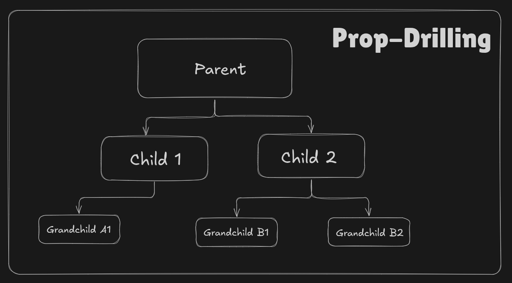

# `useContext` hook in react

## What is prop drilling



- In a React app, things like current theme, logged-in user, and language settings are commonly used by many components
- Passing them from parent to child, child to grand-child is one approach, known as prop drilling, which gets very messy with bigger apps

## What is `useContext` hook

- When data needs to be shared directly from a parent to a grand-child or below, skipping the intermediate levels, React falls short
- To solve prop drilling issues, with `useContext` hook, we can create globally accessible data in the component tree, without passing props manually at every level

### React Context: Provider & Default Value

- `useContext()` gets the Provider's value only when the component is inside the Provider.
- If the component is outside/unwrapped , it gets the default value from `createContext()`.
- Updates to the Provider's value do not affect unwrapped components.

## What is context in react

- Context is a built in React feature that lets you share data across the component tree without passing props manually at every level
- It holds global data like theme, logged-in user, or language settings
- Components can read this data directly, no matter how deep they are in the tree

## Why to use `useContext` hook instead of prop drilling

- With prop drilling, data must be passed through every intermediate component, even if those components do not need it
- This makes code messy, harder to read, and harder to maintain in bigger apps
- With `useContext`, data is shared directly from the provider to any component that needs it, skipping intermediate levels
- It removes unnecessary props, keeps components clean, and reduces re-render chains caused by passing props down

## How to create context and use it with `useContext` hook

Here is one simple example showing **create → wrap → use**:

```jsx MyContext.jsx
import { createContext, useState } from "react";

// 1. Create
export const MyContext = createContext();

export function MyProvider({ children }) {
  const [name, setName] = useState("Eagle");

  // 2.1 Wrapper Function
  return (
    <MyContext.Provider value={{ name, setName }}>
      {children}
    </MyContext.Provider>
  );
}
```

```jsx App.jsx
import { MyProvider } from "./MyContext";
import Home from "./Home";

export default function App() {
  return (
    // 2.2 Wrap
    <MyProvider>
      <Home />
    </MyProvider>
  );
}
```

```jsx Home.jsx
import { useContext } from "react";
import { MyContext } from "./MyContext";

export default function Home() {
  // 3. Use
  const { name, setName } = useContext(MyContext);

  return (
    <>
      <h1>Hello {name}</h1>
      <button onClick={() => setName("John")}>Change Name</button>
    </>
  );
}
```

## useContext with multiple contexts

```jsx GlobalContext.jsx
import { createContext } from "react";

// 1. Creating ThemeContext,NameContext and export ThemeContext, NameContext
export const ThemeContext = createContext({});
export const NameContext = createContext({});
```

```jsx UseContextApp.jsx
import React, { useState, createContext } from "react";

import UseContextHome from "./UseContextHome";
import { NameContext, ThemeContext } from "./GlobalContext.jsx";

export default function UseContextApp() {
  const [name, setName] = useState("devdotmaverick");
  const [theme, setTheme] = useState("light");

  return (
    // 2. wrapping component with provider
    <NameContext.Provider value={{ name, setName }}>
      <ThemeContext.Provider value={{ theme, setTheme }}>
        <UseContextHome />
      </ThemeContext.Provider>
    </NameContext.Provider>
  );
}
```

```jsx UseContextHome.jsx
import React, { useContext } from "react";

import { NameContext, ThemeContext } from "./GlobalContext.jsx";

export default function UseContextHome() {
  // using app context
  const nameContext = useContext(NameContext);
  const themeContext = useContext(ThemeContext);

  return (
    <div className="flex flex-col items-center mx-10 my-5 p-8 max-w-md w-full bg-white border border-gray-200 shadow-lg rounded-2xl">
      <div className="flex flex-col gap-6 w-full">
        <div className="flex flex-col gap-3 items-center px-4 py-3 w-full bg-blue-50 rounded-lg">
          <h1 className="font-medium text-blue-700">
            Current Name Value :{" "}
            <span className="font-bold text-blue-900">{nameContext.name}</span>
          </h1>
          <input
            type="text"
            id="name-input"
            className="px-4 py-3 w-full text-gray-700 border border-gray-300 duration-200 transition focus:border-transparent focus:outline-none focus:ring-2 focus:ring-blue-500 rounded-lg"
          />
          <button
            onClick={() =>
              nameContext.setName(document.querySelector("#name-input").value)
            }
            className="px-6 py-3 font-semibold text-white bg-blue-500 duration-200 transition active:scale-95 hover:bg-blue-600 rounded-lg"
          >
            Change Name
          </button>
        </div>

        <div className="flex flex-col gap-3 items-center px-4 py-3 w-full bg-purple-50 rounded-lg">
          <h1 className="font-medium text-purple-700">
            Current Theme Value :{" "}
            <span className="font-bold text-purple-900">
              {themeContext.theme}
            </span>
          </h1>
          <input
            type="text"
            id="theme-input"
            className="px-4 py-3 w-full text-gray-700 border border-gray-300 duration-200 transition focus:border-transparent focus:outline-none focus:ring-2 focus:ring-purple-500 rounded-lg"
          />
          <button
            onClick={() =>
              themeContext.setTheme(
                document.querySelector("#theme-input").value,
              )
            }
            className="px-6 py-3 font-semibold text-white bg-purple-500 duration-200 transition active:scale-95 hover:bg-purple-600 rounded-lg"
          >
            Change Theme
          </button>
        </div>
      </div>
    </div>
  );
## useContext with multiple contexts
}
```

## useContext vs Redux

## `useContext` vs Redux

1. State management complexity
   - with `useContext` it handles simple global state
   - with Redux it handles complex state logic with actions and reducers

2. Performance
   - with `useContext` all consumers re-render on any change
   - with Redux only connected components re-render on selected state change

3. Debugging tools
   - with `useContext` there are no built-in devtools
   - with Redux there are powerful devtools for time travel and action logs

4. Async data flow
   - with `useContext` async logic must be handled manually
   - with Redux async is handled with middleware like thunk or saga

5. Middleware support
   - with `useContext` there is no middleware support
   - with Redux middleware is built in for logging, async, and more

6. Boilerplate code
   - with `useContext` there is very little boilerplate
   - with Redux there is a lot of boilerplate with actions, reducers, and store

7. Ideal for
   - with `useContext` it is ideal for small to medium apps with simple shared state
   - with Redux it is ideal for large apps with complex and frequently changing state

## When to use `useContext` hook

- When data is needed by many components at different levels, because passing props through each level becomes messy
- When data is global in nature, like theme, language, or logged-in user, because it belongs to the whole app
- When prop drilling becomes messy and hard to maintain, because context skips intermediate components
- When you want to avoid passing props through components that do not need them, because it keeps those components clean
- When the data changes rarely and is shared widely, because context re-renders all consumers on change

## When not to use `useContext` hook

- When data is used by only one or two components, because props are simpler and clearer
- When data changes very frequently, because it re-renders every consumer on each change
- When the state is local to a component, because `useState` keeps it scoped and simple
- When the app is small and prop drilling is not a problem, because context adds unnecessary setup
- When you need fine control over re-renders, because context re-renders all consumers together
- When the data is complex and better handled by a state library like Redux or Zustand, because they offer better tools for large state

## Advance usage of `useContext` hook

## Common Mistakes with `useContext` hook

- Using context for state that only one or two components need, which is overkill
- Forgetting to wrap components with the Provider, which makes `useContext` return the default value
- Passing a new object or function as the value on every render, which re-renders all consumers
- Using multiple contexts for related data instead of grouping them
- Using context for frequently changing state, which re-renders every consumer
- Forgetting to export the context, which breaks imports in other files
- Reading context outside a component, which is not allowed
- Assuming context replaces a state manager like Redux for complex apps
